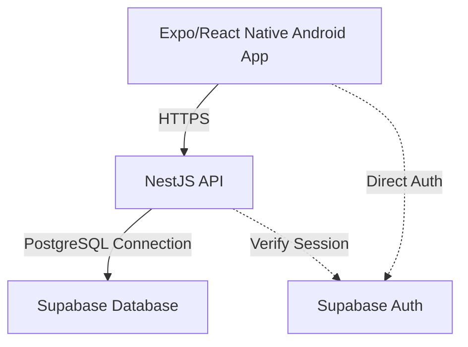

# AutoGuardian Technical README

> **IMPORTANT**: This is the single source of truth and technical handover document for the entire AutoGuardian project. Every significant development change must update this README.

This repository contains the foundation for AutoGuardian, an Android-first mobile application with a NestJS backend and a Supabase/PostgreSQL database.

## 1. Project Understanding

**What is AutoGuardian?**
AutoGuardian is a vehicle registration, verification, and management platform. It allows authorities to enroll vehicles, issue physical/digital seals (QR codes), verify credentials via mobile devices, and track ownership.

**What problem does it solve?**
It provides secure, traceable vehicle registration and identity verification, targeting regions requiring strong anti-fraud controls (e.g., duplicate chassis detection, verifiable seal installation).

**Who uses it?**
- **Consumers:** Vehicle owners managing their properties and payments.
- **Agents:** Authorized enrollers installing seals and registering vehicles.
- **Institutions:** Police, registries, or insurers verifying clearances.
- **Administrators:** Platform/Authority managers overseeing the system.

**What platforms are involved?**
- Android (Primary mobile app via Expo/React Native)
- Web (Browser preview for development)

**What is the current development scope?**
Currently, the **foundation** is in place. This includes the database schema (with strict RLS and tenant isolation), a restricted NestJS API for identity/vehicle reads and enrollment drafts, and a React Native frontend prototype with routing and simulated preview UI.

**What is V1?**
V1 involves a connected core journey: agent enrollment → payment/check → owner alert → response. It will support offline drafts, SMS/OTP, and physical seal verification.

**What belongs to later versions?**
Ownership transfers, advanced subscriptions, complex DGI/police API integrations, and an iOS release.

---

## 2. Current Project Status

| Area | Status | Details |
| --- | --- | --- |
| Frontend foundation | ✅ IMPLEMENTED AND VERIFIED | React Native, Expo Router, English/French locales, base UI components exist. |
| Supabase | ⚠️ IMPLEMENTED BUT NOT FULLY VERIFIED | Core tables, roles, tenant schema, and RLS exist in SQL and are verified in PGlite. Hosted deployment requires manual SQL execution. |
| Authentication | 🟡 PARTIALLY IMPLEMENTED | Development email login and backend profile provisioning exist. Real SMS OTP is blocked pending provider integration. |
| Vehicle management | 🟡 PARTIALLY IMPLEMENTED | Vehicle reads and list/detail APIs exist. Transfers and edits are not implemented. |
| Enrollment | 🟡 PARTIALLY IMPLEMENTED | The designed agent tabs and five-step wizard now use draft APIs, encrypted sample owner details/evidence, versioned sample consent, provisional fitting and readiness/review. Production authentication, owner OTP/consent proof, payment, review and activation remain pending. |
| Verification | ❌ NOT IMPLEMENTED | Institutional lookups are frontend mocks only. |
| Payments | ❌ NOT IMPLEMENTED | No payment provider is integrated. |
| Notifications | ❌ NOT IMPLEMENTED | No SMS/Push notification provider is integrated. |
| Admin | 🟡 PARTIALLY IMPLEMENTED | Frontend UI mock exists. No administrative APIs are implemented. |
| Security | 🟡 PARTIALLY IMPLEMENTED | Tenant isolation, basic RLS, and API guards are implemented. Encryption of attachments/local DB is pending final testing. |
| Testing | ⚠️ IMPLEMENTED BUT NOT FULLY VERIFIED | Unit/API tests via PGlite pass. Android device acceptance testing is not fully completed. |
| Deployment | 🟡 PARTIALLY IMPLEMENTED | Local tooling, EAS build profiles and a documented hosted development evidence probe exist. Production deployment and release acceptance remain pending. |

---

## 3. Implementation Status Legend

- **✅ IMPLEMENTED AND VERIFIED**: The functionality exists and has been executed/tested successfully.
- **⚠️ IMPLEMENTED BUT NOT FULLY VERIFIED**: Code exists, but complete execution, integration, or real-device testing is still pending.
- **🟡 PARTIALLY IMPLEMENTED**: Some portion exists but the complete workflow is not finished.
- **❌ NOT IMPLEMENTED**: The functionality does not currently exist.
- **📋 PLANNED**: The functionality is part of the intended roadmap but has not been implemented.
- **🚧 BLOCKED**: Implementation depends on an external provider, API, credential, agreement, design decision, or other dependency.

---

## 4. Complete Architecture Documentation



**Architecture Explanation:**
- **Frontend Framework:** React Native via Expo SDK 57. Navigation uses Expo Router.
- **Backend Architecture:** NestJS API (`backend/src/`). The backend acts as a secure proxy and business logic enforcer for operations that cannot be safely exposed via direct PostgREST (e.g., complex enrollment validation, private bucket signing).
- **Database:** Supabase PostgreSQL. Enforces multi-tenancy and complex state constraints via triggers.
- **Authentication:** Supabase Auth (JWT). Currently using a development-only email flow.
- **API Layer:** Mobile app communicates with NestJS backend for vehicle data and enrollments.
- **Storage:** Supabase Storage (private buckets) for attachments.
- **Security Boundaries:** Strict RLS at the database level. API endpoints set a restricted transaction-local PostgreSQL role.

---

## 5. Complete Directory / Code Structure

```text
AutoGuardian/
├── backend/                  # NestJS API
│   ├── src/                  # API endpoints (app.ts, main.ts, auth.ts, enrollments.ts, etc.)
│   └── tests/                # Backend isolated tests
├── docs/                     # Project documentation, reviews, and setup guides
├── mobile/                   # React Native (Expo) Frontend
│   ├── src/
│   │   ├── app/              # Expo Router pages (auth, consumer, agent, institutional, administration)
│   │   ├── components/       # Shared UI primitives
│   │   ├── config/           # App runtime configuration
│   │   ├── features/         # Feature boundaries (auth, verification, enrollment, etc.)
│   │   ├── i18n/             # Translations (English/French)
│   │   ├── providers/        # React Contexts (Query, session)
│   │   ├── services/         # API helpers and Supabase clients
│   │   └── theme/            # Design tokens
│   └── tests/                # Frontend tests
├── scripts/                  # CI/CD and utility scripts
└── supabase/                 # Database schema and configuration
    ├── migrations/           # Manual SQL migration files (001 - 012)
    └── tests/                # PGlite isolated DB tests
```

---

## 6. Database Architecture

The database is heavily normalized and utilizes a `tenant_id` for absolute isolation.

| Table | Purpose | Status | PK | FKs | Important Columns |
| --- | --- | --- | --- | --- | --- |
| `app.tenants` | Authorities/Organizations | ⚠️ Exists | `id` | None | `code`, `status`, `country_code`, `currency_code` |
| `app.roles` | Catalog of 14 system roles | ⚠️ Exists | `code` | None | `self_registration_allowed` |
| `app.users` | Links Supabase Auth to Tenant Profile | ⚠️ Exists | `id` | `tenant_id`, `auth_user_id` | `status`, `preferred_language` |
| `app.organizations` | Sub-entities (Dealers, Police, etc.) | ⚠️ Exists | `id` | `tenant_id` | `type`, `status` |
| `app.role_assignments` | Grants roles to users (scoped by org) | ⚠️ Exists | `id` | `tenant_id`, `user_id`, `role_code`, `organization_id` | `valid_from`, `valid_to` |
| `private.owners` | Legal ownership identity (Person/Entity) | ⚠️ Exists | `id` | `tenant_id`, `user_id` | `kind`, `legal_name`, `registration_number` |
| `app.vehicles` | Core vehicle record | ⚠️ Exists | `id` | `tenant_id` | `chassis_identifier`, `current_plate`, `category`, `sale_status`, `record_status` |
| `app.ownerships` | Current and historical vehicle owners | ⚠️ Exists | `id` | `tenant_id`, `vehicle_id`, `owner_id` | `start_at`, `end_at`, `source` |
| `private.identity_events` | Audit log for profile provisioning | ⚠️ Exists | `id` | `tenant_id`, `auth_user_id` | `event_type` |
| `app.agent_accreditations` | Verifies agents can enroll | ⚠️ Exists | `id` | `tenant_id`, `user_id`, `organization_id` | `status`, `valid_from`, `valid_to` |
| `app.enrollment_drafts` | Offline-first draft storage | ⚠️ Exists | `id` | `tenant_id`, `created_by`, `organization_id`, `owner_profile_id` | `creation_key`, `chassis_identifier`, `revision` |
| `private.enrollment_events` | Audit log for drafts | ⚠️ Exists | `id` | `tenant_id`, `agent_user_id`, `draft_id` | `action` (`DRAFT_CREATED`, `DUPLICATE_REJECTED`) |
| `private.enrollment_attachments` | Metadata for staged files | ⚠️ Exists | `id` | `tenant_id`, `draft_id` | `storage_path`, `purpose`, `status` |
| `private.development_seal_stock` | Mock stock for dev environment | ⚠️ Exists | `id` | `tenant_id`, `assigned_to` | `seal_type`, `seal_identifier`, `status` |

---

## 7. Database Relationships

- **Tenant isolation:** EVERY core table has a `tenant_id` and composite foreign keys enforcing that relationships stay within the same tenant.
- **Organization → Users:** Users can belong to multiple organizations via `app.role_assignments`.
- **Users → Roles:** Granted via `app.role_assignments`.
- **Vehicles → Ownership:** 1-to-Many historical, strictly 1-to-1 active (enforced by `check_active_vehicle_owner` deferred trigger).
- **Vehicles → Enrollment:** `app.enrollment_drafts` holds temporary data before finalizing into `app.vehicles`.
- **Seals:** `private.development_seal_stock` assigns physical seals to an `agent_accreditation` user.

---

## 8. Database SQL / Migrations

These are manual SQL files, NOT yet managed by Supabase CLI.

- `001_core_foundation.sql`: ✅ IMPLEMENTED AND VERIFIED (in dev). Creates core schema, tables, roles, and RLS locks.
- `002_default_permissions.sql`: ✅ IMPLEMENTED AND VERIFIED. Revokes permissive grants.
- `003_identity_api.sql`: ✅ IMPLEMENTED AND VERIFIED. Creates restricted role and identity functions.
- `004_owned_vehicle_reads.sql`: ✅ IMPLEMENTED AND VERIFIED. RLS for vehicle owner queries.
- `005_enrollment_drafts.sql`: ✅ IMPLEMENTED AND VERIFIED. Schema for drafts and accreditations.
- `006_development_owner_selection.sql`: ⚠️ IMPLEMENTED BUT NOT FULLY VERIFIED. Dev-only mock owners.
- `007_enrollment_attachments.sql`: ⚠️ IMPLEMENTED BUT NOT FULLY VERIFIED. Attachment staging schema.
- `008_development_seal_fitting.sql`: ⚠️ IMPLEMENTED BUT NOT FULLY VERIFIED. Synthetic stock and provisional fitting, tested locally; hosted acceptance remains separate.
- `009_enrollment_readiness.sql`: ✅ IMPLEMENTED AND VERIFIED LOCALLY. Adds a restricted read-only readiness function. Hosted execution and signed-in UI acceptance are pending; see [readiness setup](docs/DEVELOPMENT-ENROLLMENT-READINESS.md).
- `010_enrollment_owner_consent.sql`: ✅ IMPLEMENTED AND VERIFIED LOCALLY; hosted installation was subsequently confirmed. Adds encrypted sample owner details and versioned sample consent.
- `011_enrollment_evidence_checklist.sql`: ✅ IMPLEMENTED AND VERIFIED LOCALLY. Adds the eight-item saved evidence checklist, purchase-proof alternative and distinct photo requirements. Hosted application and interactive acceptance remain pending; see [setup](docs/DEVELOPMENT-EVIDENCE-CHECKLIST.md).

**SQL Still Requiring Execution:**
Any new development deployment requires running `001` through `012` sequentially in the Supabase SQL editor, plus the applicable development setup scripts. Existing deployments apply only missing migrations; do not replay applied migrations. Production setup must exclude synthetic data and development-only authentication/workflows.

---

## 9. RLS AND DATABASE SECURITY

RLS is strictly enforced.
- **Default:** `REVOKE ALL ON SCHEMA app, private FROM public, anon, authenticated, service_role`.
- **API Access:** The NestJS API connects using a restricted login role (`autoguardian_identity_login` or similar). It uses `SET LOCAL role` and explicit functions (e.g., `private.request_tenant_id()`) to execute queries with transaction-local context.
- **Client Access:** The mobile client NEVER talks directly to PostgREST for business data. Supabase Auth is used ONLY for identity.
- **Tenant Isolation:** RLS policies explicitly check `tenant_id = private.request_tenant_id()`.

---

## 10. AUTHENTICATION

- **Current Implementation:** Supabase Auth with Development Email Login.
- **Intended Production:** Phone OTP (SMS).
- **Backend Flow:** Client sends Supabase JWT to NestJS (`Authorization: Bearer <token>`). NestJS validates it via Supabase Admin SDK (`getUser`), provisions/fetches the user profile in `app.users`, and retrieves roles.
- **Status:** 🟡 PARTIALLY IMPLEMENTED. Real SMS integration is blocked pending provider selection. 14 business roles exist in DB, but deep authorization checks across all endpoints are pending.

---

## 11. ENCRYPTION AND SECURITY

- **Secrets:** Handled via `.env` files (not committed).
- **Local Mobile Storage:** Uses Expo `SecureStore` for session tokens. SQLCipher is configured via plugins for local SQLite encryption, but offline storage workflows are ❌ NOT IMPLEMENTED.
- **API Security:** NestJS enforces JWT validation on protected routes.
- **File Uploads:** The server encrypts synthetic evidence with AES-256-GCM before private Supabase Storage upload and verifies ciphertext by read-back/decryption. Production key rotation/recovery, provider encryption/backup assurance and native attachment encryption remain pending.
- **Missing:** Real encryption keys, robust rate-limiting on SMS/OTP, CSRF (mobile uses tokens), audit logs on all tables.

---

## 12. FRONTEND IMPLEMENTATION

- **Framework:** React Native + Expo Router.
- **State:** TanStack Query + React Hook Form + Zod.
- **Status:** 🟡 PARTIALLY IMPLEMENTED. Heavy use of visual UI mocks ("Previews") without business logic.

**Implemented Frontend Screens:**

| Screen | Route/File | Purpose | Backend Connected? | Status |
| --- | --- | --- | --- | --- |
| Root Index | `src/app/index.tsx` | Routes to sections | No | ⚠️ PREVIEW |
| Live Account | `src/app/live-account.tsx` | Shows auth/roles | Yes | ⚠️ PREVIEW |
| Welcome | `src/app/welcome.tsx` | Entry point | No | ⚠️ PREVIEW |
| OTP Verify | `src/app/(auth)/verify-otp.tsx` | Login flow | Mocked | 🟡 PARTIAL |
| Consumer Layout | `src/app/(consumer)/_layout.tsx` | Tab layout | No | ⚠️ PREVIEW |
| Agent Account | `src/app/agent/account.tsx` | Agent dashboard | No | ⚠️ PREVIEW |
| Live Vehicles | `src/app/live-vehicles/...` | Owned vehicles | Yes | 🟡 PARTIAL |
| Live Enrollments| `src/app/live-enrollments/...`| Draft saving | Yes | 🟡 PARTIAL |
| Admin Account | `src/app/administration/...`| Admin panel | No | ⚠️ PREVIEW |

---

## 13. BACKEND / API IMPLEMENTATION

NestJS API located in `backend/src/`.

| Endpoint | Method | Purpose | Auth | Status |
| --- | --- | --- | --- | --- |
| `/v1/health` | GET | Health check | None | ✅ VERIFIED |
| `/v1/me/profile` | POST | Provisions profile | JWT | ✅ VERIFIED |
| `/v1/me` | GET | Returns profile/roles | JWT | ✅ VERIFIED |
| `/v1/me/vehicles` | GET | Lists owned vehicles | JWT | ✅ VERIFIED |
| `/v1/me/vehicles/:id` | GET | Details of a vehicle | JWT | ✅ VERIFIED |
| `/v1/enrollment-drafts`, `/v1/enrollment-drafts/:id` | GET/POST, GET/PUT | List/create/read/update drafts | JWT (development agent) | 🟡 PARTIAL |
| `/v1/enrollment-drafts/:id/attachments`, `/:attachmentId/read` | GET/POST, POST | Encrypted sample uploads and authorized recovery | JWT (development agent) | 🟡 PARTIAL |
| `/v1/seal-stock`, `/v1/enrollment-drafts/:id/seals` | GET, GET/POST | Assigned sample stock and provisional fitting | JWT (development agent) | 🟡 PARTIAL |
| `/v1/enrollment-drafts/:id/seals/validate` | POST | Read-only per-position stock/type/photo diagnostics | JWT (development accredited agent) | ✅ VERIFIED LOCALLY; requires migration 012 |
| `/v1/enrollment-drafts/:id/readiness` | GET | Saved development checklist and explicit production blockers | JWT (development accredited agent) | ✅ VERIFIED LOCALLY; requires migrations through 012 |

---

## 14. DATABASE QUERIES

Important queries are encapsulated in PostgreSQL functions to prevent backend tampering:
- `private.enrollment_agent_id(uuid)`: Validates agent accreditation securely.
- `private.save_enrollment_draft(...)`: Handles idempotency, conflict detection, and JSON packing of draft data in a single transaction.
- `private.check_active_vehicle_owner()`: Deferred trigger ensuring exactly one owner exists when a vehicle becomes `ACTIVE`.

---

## 15. VEHICLE ENROLLMENT WORKFLOW

- **Implemented:** Draft creation (save to `app.enrollment_drafts`), duplicate chassis/plate detection (provisional), attachment staging (metadata tracking).
- **Missing (Not Implemented):** Owner phone OTP confirmation, real payment collection, final registration (converting draft to `app.vehicles`), activation.

---

## 16. VEHICLE VERIFICATION WORKFLOW

- ❌ NOT IMPLEMENTED. Institutional lookup screens are frontend mocks. No backend endpoints exist for police/registry verification.

---

## 17. VEHICLE STATUS / BUSINESS LOGIC

- **Sale Status:** `NOT_FOR_SALE`, `FOR_SALE`, `AGENT_SALE`, `REPORTED_MISSING`.
- **Record Status:** `PENDING_REVIEW`, `ACTIVE`, `SUSPENDED_UNPAID`, `BLOCKED`, `ARCHIVED`.
- **Implementation:** Defined in `app.vehicles` CHECK constraints. State transition logic (who can change it and when) is ❌ NOT IMPLEMENTED in the backend API.

---

## 18. ROLES AND PERMISSIONS

14 Roles defined in `app.roles`:
`VERIFIER`, `OWNER`, `BACKUP_CONTACT`, `SELLER_AGENT`, `PRO_VERIFIER`, `ENROLLMENT_AGENT`, `ENROLLMENT_ORG_ADMIN`, `LAW_ENFORCEMENT`, `REGISTRY_OFFICER`, `INSURER`, `TENANT_ADMIN`, `SUPPORT`, `AUDITOR`, `PLATFORM_ADMIN`.

- **Implementation:** Backend reads roles and returns them via `/v1/me`. `ENROLLMENT_AGENT` is checked during draft creation. Strict middleware authorization guards for other roles are 🟡 PARTIALLY IMPLEMENTED (missing endpoint-specific logic).

---

## 19. ORGANIZATIONS / MULTI-TENANCY

- **Implementation:** Strict Tenant Isolation. The backend `AUTOGUARDIAN_TENANT_ID` env variable locks the API instance to a single authority. RLS absolutely prohibits cross-tenant data access. Organizations (`app.organizations`) sub-divide tenants (e.g. Police departments, Dealerships).

---

## 20. DEVELOPMENT LOGIN / TEST DATA

- **Auth:** Uses Email/Password development mock instead of real SMS.
- **SQL Scripts:** `setup-identity-login.sql`, `setup-development-tenant.sql`, `setup-development-vehicle.sql`, `setup-development-agent.sql`.
- **DO NOT USE IN PRODUCTION.** These grant fake accreditations and ownerships to test accounts.

---

## 21. TESTING

- **Automated DB Tests:** PGlite tests run against migrations (`npm run test` in `supabase/` and `backend/`). Status: ✅ PASSED.
- **Frontend Checks:** TypeScript, Lint, Expo Doctor. Status: ✅ PASSED.
- **Missing:** End-to-end integration tests, real Android device offline capability tests.

---

## 22. KNOWN BUGS AND LIMITATIONS

- **Authentication:** No real SMS OTP; relies on email bypass in dev.
- **Offline Mode:** Front-end SQLite caching and background sync is totally missing.
- **UI Mocks:** Most interactive buttons in the app lead to placeholder components.
- **Images/Uploads:** A real private Storage adapter and encrypted sample upload/download lifecycle exist. Downloads are authorized and audited through the backend, without public/signed URLs. Production evidence validation and native capture remain pending.

---

## 23. TODO / REMAINING DEVELOPMENT

### P0 - Critical
- Finalize production SMS/OTP Authentication.
- Complete the Agent Enrollment workflow (from draft to active vehicle).
- Payment provider integration.

### P1 - Important
- Complete RLS and API endpoints for Institutional Verification.
- Offline-first SQLite persistence in the mobile app.

### P2 - Later
- Ownership transfers.
- Admin dashboard reporting API.

---

## 24. NEXT AGENT INSTRUCTIONS

**CURRENT STARTING POINT:**
The database foundation, NestJS API architecture, and React Native frontend scaffolding are in place. Enrollment drafts can be saved via the API.

**Before adding new functionality:**
1. Read this README.
2. Verify the backend can run (`npm run start` in `/backend`).
3. Verify the frontend can run (`npm run web` in `/mobile`).

**NEXT RECOMMENDED TASK:**
> Apply missing development migrations 011 and 012, then finish browser/Android acceptance of the evidence checklist and seal checks (see docs/DEVELOPMENT-SEAL-VALIDATION.md). Hosted 010 was previously confirmed; 011–012 are verified locally only. Phone OTP remains deferred by the project owner. Next define category-specific fitting positions and authenticated seal issuance, then implement production evidence review, payment, authority review rules and atomic finalization. OTP, production consent proof and stronger agent authentication must be completed before activation is enabled. Development samples must not satisfy production prerequisites.
>
> The backend already supports verified phone identities. Production draft access remains deliberately disabled until stronger agent authentication is implemented. Do not turn client or simulated payment success into production registration.

**Rules for Agents:**
- Do not recreate already implemented tables.
- Write new SQL migrations in `supabase/migrations/` sequentially (next: `013_...`).
- Never expose secrets.
- Update this README when you implement a new feature.

---

## 25. Development Roadmap

- **Phase 1 (Done):** Foundation, DB Schema, Basic API, Frontend Scaffolding.
- **Phase 2 (Next):** Authentication (SMS) & Enrollment Completion (Activation).
- **Phase 3:** Payments & Notifications.
- **Phase 4:** Institutional Verification & Admin APIs.
- **Phase 5:** Offline Sync & Security Hardening.

---

## 26. Current SRS Requirements vs Implementation

| Requirement | Implementation | Status |
| --- | --- | --- |
| R1: Tenant Isolation | DB RLS & FKs | ✅ VERIFIED |
| R2: Agent Enrollment | Draft APIs | 🟡 PARTIAL |
| R3: Offline Mode | Not Started | ❌ NOT IMPLEMENTED |
| R4: Police Verification | UI Mock | ❌ NOT IMPLEMENTED |
| R5: Mobile Payments | Not Started | ❌ NOT IMPLEMENTED |

---

## 27. External Integrations

| Integration | Provider | Status | Blocker |
| --- | --- | --- | --- |
| SMS / OTP | None chosen | ❌ NOT IMPLEMENTED | Awaiting provider credentials |
| Payments | None chosen | ❌ NOT IMPLEMENTED | Awaiting provider credentials |
| External Police DB | None | 📋 PLANNED | Awaiting API agreements |

---

## 28. Environment Variables

**Backend (`backend/.env`):**
- `SUPABASE_URL`: Required. The project URL.
- `SUPABASE_ANON_KEY`: Required.
- `DATABASE_URL`: Required. Connection string for NestJS.
- `AUTOGUARDIAN_TENANT_ID`: Required. UUID of the active authority.

**Frontend (`mobile/.env`):**
- `EXPO_PUBLIC_SUPABASE_URL`: Required.
- `EXPO_PUBLIC_SUPABASE_ANON_KEY`: Required.
- `EXPO_PUBLIC_APP_MODE`: Determines live vs demo UI logic.

*(No actual secret values are stored in git.)*

---

## 29. Commands

**Backend:**
```bash
cd backend
npm install
npm run test
npm run start
```

**Mobile:**
```bash
cd mobile
npm install
npm run web       # Browser preview
npm run android   # Android (Requires Emulator/Device setup)
npm run typecheck
```

---

## 30. Data Flow

**Standard Authenticated Flow:**
`User` -> `React Native UI` -> `TanStack Query` -> `Backend API (Bearer JWT)` -> `NestJS AuthGuard (calls Supabase Auth)` -> `NestJS Controller` -> `Supabase PostgreSQL (executes as restricted role)` -> `Response`

---

## 31. Error Handling

- **Database:** Supabase throws specific SQL errcodes (e.g. `AG409` for idempotency conflict).
- **Backend:** NestJS catches SQL errors and transforms them into standard HTTP 4xx/5xx responses.
- **Frontend:** React Hook Form + Zod handle UI validation.

---

## 32. Validation

1. **Frontend:** Zod schemas.
2. **API:** NestJS DTOs (Data Transfer Objects).
3. **Database:** PostgreSQL `CHECK` constraints (e.g., `manufacture_year between 1886 and 2200`).

---

## 33. Audit / Logging

- **Implemented:** `private.identity_events` and `private.enrollment_events` act as append-only audit logs for critical actions.
- **Missing:** Generic request logging in NestJS, detailed admin audit dashboard.

---

## 34. File Uploads / Documents

- **Implemented:** `private.enrollment_attachments` table tracks file metadata. Supabase Storage buckets are used to hold the files.
- **Security:** Private buckets require backend-signed URLs for access.

---

## 35. Offline Functionality

`OFFLINE SUPPORT NOT YET IMPLEMENTED`
The UI has states for offline, but data caching (via SQLite) and queue synchronization are completely absent.

---

## 36. Payments

`NOT IMPLEMENTED`
No mobile money, card, or wallet integrations exist.

---

## 37. Notifications

`NOT IMPLEMENTED`
Alert screens exist in the frontend UI, but no Push Notification (FCM/APNS) or SMS system is actively delivering messages.

---

## 38. Performance

- **Database:** Heavily indexed (e.g. `vehicles_chassis_global_idx`). Pagination is implemented on `/v1/me/vehicles` via cursor.
- **Frontend:** React Native lists use virtualization, but real-device performance profiling has not been done.

---

## 39. Deployment

- **Current:** Local development environments only.
- **Prepared:** Development, preview and production EAS profiles; local numbered review APK tooling. A hosted development Storage probe is documented in `docs/DEVELOPMENT-EVIDENCE-UPLOADS.md`.
- **Missing:** Verified production build/deployment, CI/CD, operational monitoring and production recovery/acceptance.

---

## 40. Change History

1. Initial Repo Setup & Expo Scaffolding.
2. Database Schema Design & Migrations (001-008).
3. NestJS Backend created for Identity and Vehicle Reads.
4. Enrollment Draft endpoints implemented.
5. Mobile UI migrated from Stitch prototypes to placeholder components.
6. 8 October 2026: Added migration 009, scoped readiness API and bilingual enrollment review screen. Local automated tests pass; hosted execution and device acceptance remain pending.

---

## 41. IMPORTANT DISTINCTION: CODE VS EXECUTION

- **Exists in repository:** SQL files in `supabase/migrations/`.
- **Executed:** ONLY if you manually run them in your Supabase SQL Editor.
- **Verified:** Tested via local PGlite unit tests, NOT in a production live-data scenario.

---

## 42. AI AGENT HANDOVER SECTION

**Instructions for Future Agents:**
Read this README *before* modifying the project. Inspect the repository before making assumptions. Respect the existing architecture (specifically, the backend API boundary and strict database RLS).

Do not overwrite working database logic. Do not expose secrets. Check existing API endpoints before creating new ones.

Before beginning a new task, review the **Current Project Status** and **Next Agent Instructions** sections.

---

## 43. README MAINTENANCE RULE

> **Every significant development change must update this README.**

Update the status from `PLANNED` -> `IMPLEMENTED` -> `VERIFIED` only when justified by functioning, tested code. Record new database changes, APIs, and known bugs directly into this document.

## 44. Enrollment readiness and review — 8 October 2026

Saved drafts now link to **Review enrollment readiness**. The backend computes a
checklist from current saved metadata, eligible owner selection, staged samples
for the current proposed owner and provisional fitting. Pending uploads do not
count; draft changes mark fitting stale and revoked stock makes fitting incomplete.
The page refreshes on return and hides old results while loading or after errors.

Production agent authentication, owner OTP, versioned consent, full evidence and
physical seal validation, payment, authority review rules and finalization remain
explicitly unavailable. `canSubmit` and `enrollmentActive` are always false in this
development increment. No submission endpoint or new vehicle/ownership writes
were introduced. See [setup and acceptance steps](docs/DEVELOPMENT-ENROLLMENT-READINESS.md).

Validation: backend build and 21 tests, mobile typecheck/lint and 25 tests, web
bundle export, and 123 isolated database foundation checks pass. Hosted migration 009 was
subsequently confirmed by a read-only runtime check, and the user reported completing
the manual development walkthrough. Android acceptance remains pending. Expo online compatibility
checks report newer recommended patch versions for seven existing dependencies;
dependency upgrades are separate from this change. Expo Doctor passes 20/21 checks;
the remaining check is those existing patch-version mismatches.

Browser focus fix (8 October 2026): returning to the same tab no longer refetches
the enrollment draft list or readiness checklist. Readiness navigation refresh
depends on profile availability rather than the replaceable profile object, so
same-account background authentication refresh does not blank the review page.
Returning from another route and explicit Refresh still reload saved server data;
identity/permission changes continue to clear account state. Owned-vehicle reads
retain their existing ownership revalidation behavior.

## 45. Owner details and versioned sample consent — 8 October 2026

Connected development drafts now have **Owner details and sample consent** from
the list, edit screen and readiness review. Individual/company identity fields,
company representative/registration, international phone and FR/EN preference are
validated server-side and encrypted before database storage. Unsaved identity
forms and retry bodies remain in screen memory; browser working-copy storage is
unchanged and does not receive them.

Versioned bilingual sample terms/data require separate explicit acknowledgments.
Records capture the proposed owner, recording agent, text version/language,
generation and server time; withdrawal appends a new event. Existing versions
cannot be rewritten. These records are **agent-recorded development samples**,
not authenticated owner acceptance, legally approved terms or insurer consent.
Phone OTP is deferred at the project owner's request; `phoneVerified` and
`productionConsentVerified` remain false.

Changing the proposed owner or saving identity details advances the owner
generation. Previous evidence/details/consent cannot reappear when switching back;
fitting becomes stale. Save owner details before staging evidence and fitting.
Readiness adds **Sample owner details** and **Sample versioned consent**, while
all production blockers and disabled submission remain in place.

New migration: [010](supabase/migrations/202610080010_enrollment_owner_consent.sql).
New APIs: `GET/POST /v1/enrollment-drafts/:id/owner` and
`POST /v1/enrollment-drafts/:id/owner/consent`; UUID idempotency keys and expected
revisions guard writes. Identity reads are audited, scoped by forced RLS and
returned with no-store headers. The existing server enrollment encryption key
derives separate owner encryption/HMAC keys. Do not replace that key.

Validation: backend build and 24 tests, mobile typecheck/lint and 28 tests, browser
bundle export and 123 isolated foundation checks pass. Migration 010 also passes
installation under a non-superuser schema owner. Online dependency validation was
blocked by network restrictions; the offline check passes with Expo's reliability
warning. The seven previously reported newer recommended patches remain a separate
maintenance task. Hosted 010 installation was subsequently confirmed by a read-only runtime check and the user reported completing owner saves. Full browser/native acceptance remains pending. Follow [setup and acceptance](docs/DEVELOPMENT-OWNER-CONSENT.md), then
restart **Start Backend.cmd**. Real identity collection, production authentication,
OTP/consent proof, full evidence/physical seal checks, payment, authority review and
atomic finalization remain unfinished. Native encrypted offline storage is unchanged.

Owner form feedback fix (8 October 2026): validation errors now identify the
affected field directly. The phone field explains that a country prefix such as
`+92` needs the rest of the fictional number, with a complete sample shown. Saving
unchanged details displays the saved state on the disabled button. Phone format
validation remains required and does not imply OTP verification.

## 46. Connected agent UI and enrollment wizard — 9 October 2026

Language preference update: English is now the default app language in preview and
live modes, as requested by the project owner. French remains selectable. New owner
forms default to English; existing saved owner language preferences are preserved.

The original agent header, navy/yellow styling, cards and four bottom tabs now
contain the working development enrollment flow. `/agent` lists saved drafts;
`/agent/new-enrollment` provides **Vehicle → Owner → Documents → Seals → Review**.
The existing draft, owner/consent, evidence, fitting and readiness APIs drive these
screens. Old `/live-enrollments` URLs redirect to their corresponding wizard step.
The disconnected synthetic preview remains available in development demo mode.

Progress comes from saved readiness only. Unsaved changes and pending operations
disable step switching; save vehicle changes to continue to Owner, and save sample
owner acknowledgments before continuing to Documents. Identity working copies stay
in memory. Existing scoped vehicle/fitting recovery and revision/idempotency guards
remain in place. Missing drafts, invalid IDs and revoked access never use fixtures.

No new migration or backend change is needed for this UI integration. Access uses
the genuine organization-scoped development agent profile and development flags;
production agent permissions are unchanged. Phone OTP remains deferred and final
submission stays disabled, even with every sample preparation step saved.

Validation: mobile TypeScript, lint, 31 tests, web export and Android Hermes export
pass. The offline dependency check passes with Expo's reliability warning. Browser
checks confirmed the merged shell, saved-draft navigation, owner form, sample upload
controls, saved progress and disabled submission. Browser automation then stopped
because it could not reliably determine the current URL. Full interactive save,
French/text-scaling and Android device acceptance remain pending; follow the
[connected wizard guide](docs/CONNECTED-ENROLLMENT-WIZARD.md).

The detailed saved evidence checklist is now implemented in section 47 below.
Next after acceptance is physical fitting validation and production evidence
review, followed by payment, authority review rules and finalization.
Phone OTP, production consent proof and stronger agent authentication must be
completed before production activation. Encrypted native offline storage and sync
are still unfinished.

Vehicle form feedback update (9 October 2026): saving an invalid connected draft
now highlights each affected field and displays specific English/French messages
for missing chassis/category, invalid four-digit year (1886–2200), excessive field
lengths and missing/ineligible owner selection. Messages clear as entries are
corrected. Invalid forms do not reach the save API; existing retry keys and revision
guards are retained. No backend or database change is required.

Invalid vehicle saves also jump to the first problem in screen order (organization,
owner selection, then vehicle fields) and focus editable text fields. The jump runs
after inline messages render and repeats on another invalid Save; ordinary typing,
background refreshes and retrying an uncertain save do not move focus. Android
keyboard and scrolling behavior still needs device acceptance.

## 47. Detailed enrollment evidence checklist — 9 October 2026

The connected Documents and Review steps now show eight saved requirements:
owner ID; registration certificate **or** purchase proof; front, rear, left and
right vehicle views; chassis photo; and plate photo. Each row shows missing,
pending or saved status from the restricted server API. Documents progress only
completes when every requirement is staged. Generic earlier vehicle photos remain
available for audited download but do not count as a named view.

Migration [011](supabase/migrations/202610090011_enrollment_evidence_checklist.sql)
adds explicit evidence kinds, a shared server checklist and image-only constraints.
Reservations serialize on the draft and reject the same normalized image for
different required photo kinds. Registration and purchase proof are alternatives.
The attachment limit increases from 10 to 30 per current owner generation,
including pending uploads, so required documents and four fitting photos fit.
Existing keys can still retry at the limit; changed payloads cannot reuse them.
Owner changes/details edits invalidate the previous generation's evidence as before.

The attachment and readiness reads include a versioned `evidenceChecklist` without
private identity, file IDs, storage paths or hashes. Fitting's document summary uses
the same result. English/French labels, counts and upload actions are included.
Old/missing checklist setup returns unavailable, and stale results are hidden
during reloads/errors. No new secrets or replacement encryption keys are needed.

Production evidence authenticity, physical fitting inspection, authenticated
consent, OTP, payment, authority review and finalization remain unfinished.
Submission and activation remain disabled. Native private capture/offline storage
are unchanged. See [setup and acceptance](docs/DEVELOPMENT-EVIDENCE-CHECKLIST.md).

Validation: backend build and 26 tests, mobile typecheck/lint and 33 tests, web
and Android Hermes exports, offline dependency compatibility and 123 isolated
foundation checks pass. Android export required sandbox escalation for the
installed Hermes compiler; no native device test was performed.
Migration 011 also installs under a non-superuser schema owner. Hosted 011 was not
applied in this change. Browser automation failed to initialize; interactive
browser and Android-device acceptance remain pending.

Connected landing navigation fix (9 October 2026): an eligible organization-scoped
development agent now lands at `/agent` after sign-in or opening the app root.
Old `/live-account` links redirect to `/agent/account`, keeping Account inside the
merged header and four tabs. Other roles, missing/error profiles and production
sessions retain their existing account/access behavior. Both routes reuse the
existing development-agent gate; no permission or backend change is introduced.
Validation: mobile TypeScript, lint and 34 tests pass, the offline dependency check
passes with Expo's reliability warning, and port 8081 serves the updated route
code. Interactive browser verification remains unavailable in this session.

## 48. Development seal checks and code entry — 9 October 2026

Seals now accepts assigned-stock selections, QR scans and manual development
codes. A read-only server endpoint checks current stock, package types, duplicate
codes, reservations and fitting photos before accepting a typed/scanned code or
saving choices. Partial fitting drafts remain supported. Seals and Review display
four numbered diagnostic results from the server; checking does not reserve stock.
Camera permission is requested on demand, and manual entry remains available when
the camera is unavailable. Scanned links and consumer QR tokens are rejected.

Migration [012](supabase/migrations/202610090012_seal_fitting_validation.sql)
rejects identical normalized image content used for different seals, even under
different upload IDs. A failed save rolls back all fitting changes. Revision and
exact-retry handling remain intact; retries reflect later stock revocation without
another save event. Assigned-stock reservation reads also cover stock reassigned
from a previous agent, without exposing that agent's draft identifiers.

Apply missing development migrations through 012, then refresh the live agent
app. No encryption key or environment changes are needed. Hosted 012 was not
applied here. Follow [setup and acceptance](docs/DEVELOPMENT-SEAL-VALIDATION.md).
Physical positions/authenticity, production inspection and activation remain
unfinished; `physicalVerified`, submission and activation remain false.

Validation: backend build and 27 tests, mobile TypeScript/lint and 38 tests, web
and Android Hermes exports, and offline dependency compatibility pass. The Android
compiler required sandbox escalation. The updated backend was restarted and its
health/authenticated-route checks pass. Browser camera and native-device acceptance
remain pending; browser automation could not initialize in this session.
